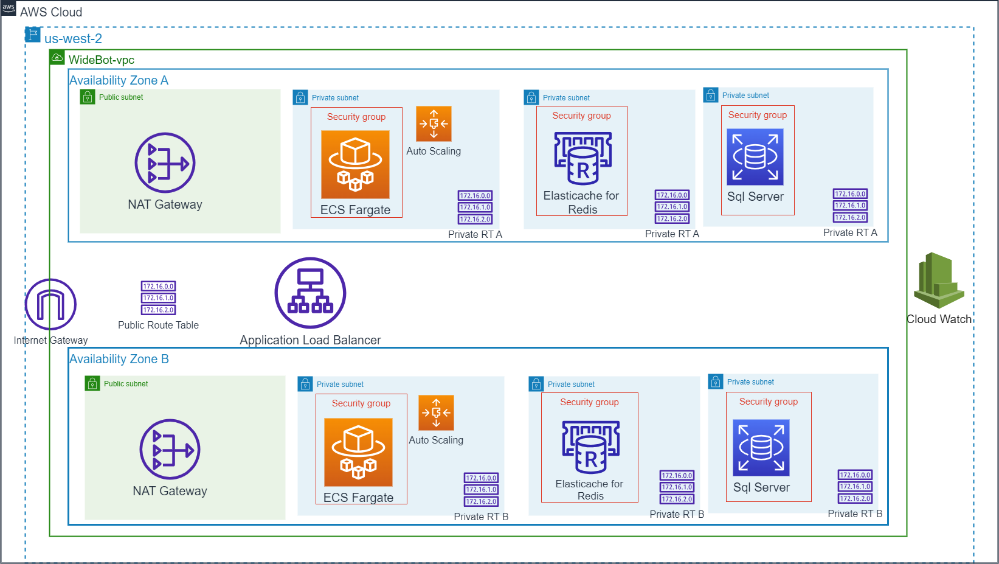

# WideBot Task First Solution
## Description
write a terraform template to provision the infrastructure for a web application and its associated databases (Sql server), and Redis for caching.
configure Load Balancer to availability and auto scale to ensure scalability .
Use AWS EKS to let up a replication controller to run pods that are accessed as services on Docker.

## Design

<!-- BEGIN_TF_DOCS -->
## Requirements

No requirements.

## Providers

| Name | Version |
|------|---------|
|  [aws](#provider\_aws) | n/a |
|  [template](#provider\_template) | n/a |

## Modules

| Name | Source | Version |
|------|--------|---------|
|  [wb-database](#module\_wb-database) | ./RDS-Module | n/a |

## Resources

| Name | Type |
|------|------|
|[alimostafa95/widebot:latest](https://hub.docker.com/repository/docker/alimostafa95/widebot/tags?page=1&ordering=last_updated) | App image |
| [aws_alb.alb](https://registry.terraform.io/providers/hashicorp/aws/latest/docs/resources/alb) | resource |
| [aws_alb_listener.load_balancer_listener](https://registry.terraform.io/providers/hashicorp/aws/latest/docs/resources/alb_listener) | resource |
| [aws_alb_target_group.alb_target_group](https://registry.terraform.io/providers/hashicorp/aws/latest/docs/resources/alb_target_group) | resource |
| [aws_appautoscaling_policy.downscaling_policy](https://registry.terraform.io/providers/hashicorp/aws/latest/docs/resources/appautoscaling_policy) | resource |
| [aws_appautoscaling_policy.outscaling_policy](https://registry.terraform.io/providers/hashicorp/aws/latest/docs/resources/appautoscaling_policy) | resource |
| [aws_appautoscaling_target.autoscaling_target](https://registry.terraform.io/providers/hashicorp/aws/latest/docs/resources/appautoscaling_target) | resource |
| [aws_cloudwatch_log_group.log_group](https://registry.terraform.io/providers/hashicorp/aws/latest/docs/resources/cloudwatch_log_group) | resource |
| [aws_cloudwatch_log_stream.log_stream](https://registry.terraform.io/providers/hashicorp/aws/latest/docs/resources/cloudwatch_log_stream) | resource |
| [aws_cloudwatch_metric_alarm.downscaling_metric_alarm](https://registry.terraform.io/providers/hashicorp/aws/latest/docs/resources/cloudwatch_metric_alarm) | resource |
| [aws_cloudwatch_metric_alarm.outscaling_metric_alarm](https://registry.terraform.io/providers/hashicorp/aws/latest/docs/resources/cloudwatch_metric_alarm) | resource |
| [aws_ecs_cluster.ecs_cluster](https://registry.terraform.io/providers/hashicorp/aws/latest/docs/resources/ecs_cluster) | resource |
| [aws_ecs_service.ecs_service](https://registry.terraform.io/providers/hashicorp/aws/latest/docs/resources/ecs_service) | resource |
| [aws_ecs_task_definition.ecs_task](https://registry.terraform.io/providers/hashicorp/aws/latest/docs/resources/ecs_task_definition) | resource |
| [aws_eip.nat_gateway_eip](https://registry.terraform.io/providers/hashicorp/aws/latest/docs/resources/eip) | resource |
| [aws_elasticache_cluster.memcached](https://registry.terraform.io/providers/hashicorp/aws/latest/docs/resources/elasticache_cluster) | resource |
| [aws_elasticache_subnet_group.subnetgroup](https://registry.terraform.io/providers/hashicorp/aws/latest/docs/resources/elasticache_subnet_group) | resource |
| [aws_internet_gateway.internet_gateway](https://registry.terraform.io/providers/hashicorp/aws/latest/docs/resources/internet_gateway) | resource |
| [aws_nat_gateway.nat_gateway](https://registry.terraform.io/providers/hashicorp/aws/latest/docs/resources/nat_gateway) | resource |
| [aws_route.internet_access](https://registry.terraform.io/providers/hashicorp/aws/latest/docs/resources/route) | resource |
| [aws_route_table.private_route_table](https://registry.terraform.io/providers/hashicorp/aws/latest/docs/resources/route_table) | resource |
| [aws_route_table_association.private_route_table_association](https://registry.terraform.io/providers/hashicorp/aws/latest/docs/resources/route_table_association) | resource |
| [aws_security_group.ecs_redis_sg](https://registry.terraform.io/providers/hashicorp/aws/latest/docs/resources/security_group) | resource |
| [aws_security_group.ecs_sql_sg](https://registry.terraform.io/providers/hashicorp/aws/latest/docs/resources/security_group) | resource |
| [aws_security_group.ecs_tasks_sg](https://registry.terraform.io/providers/hashicorp/aws/latest/docs/resources/security_group) | resource |
| [aws_security_group.load_balancer_sg](https://registry.terraform.io/providers/hashicorp/aws/latest/docs/resources/security_group) | resource |
| [aws_security_group.redis_sg](https://registry.terraform.io/providers/hashicorp/aws/latest/docs/resources/security_group) | resource |
| [aws_security_group.sql_sg](https://registry.terraform.io/providers/hashicorp/aws/latest/docs/resources/security_group) | resource |
| [aws_subnet.private_redis_subnet](https://registry.terraform.io/providers/hashicorp/aws/latest/docs/resources/subnet) | resource |
| [aws_subnet.private_sql_subnet](https://registry.terraform.io/providers/hashicorp/aws/latest/docs/resources/subnet) | resource |
| [aws_subnet.private_subnet](https://registry.terraform.io/providers/hashicorp/aws/latest/docs/resources/subnet) | resource |
| [aws_subnet.public_subnet](https://registry.terraform.io/providers/hashicorp/aws/latest/docs/resources/subnet) | resource |
| [aws_vpc.main_network](https://registry.terraform.io/providers/hashicorp/aws/latest/docs/resources/vpc) | resource |
| [aws_availability_zones.available_azs](https://registry.terraform.io/providers/hashicorp/aws/latest/docs/data-sources/availability_zones) | data source |
| [template_file.template_container_definitions](https://registry.terraform.io/providers/hashicorp/template/latest/docs/data-sources/file) | data source |

## Inputs

| Name | Description | Type | Default | Required |
|------|-------------|------|---------|:--------:|
|  [alb\_protocol](#input\_alb\_protocol) | n/a | `string` | `"HTTP"` | no |
|  [app\_image](#input\_app\_image) | n/a | `string` | `"alimostafa95/widebot:latest"` | no |
|  [aws\_region](#input\_aws\_region) | n/a | `string` | `"us-west-2"` | no |
|  [az\_count](#input\_az\_count) | n/a | `string` | `"2"` | no |
|  [balanced\_container\_name](#input\_balanced\_container\_name) | n/a | `string` | `"widebot-api"` | no |
|  [container\_port](#input\_container\_port) | n/a | `string` | `"80"` | no |
|  [ecs\_autoscale\_role](#input\_ecs\_autoscale\_role) | n/a | `string` | `"arn:aws:iam::719699785587:role/ecsAutoscaleRole"` | no |
|  [ecs\_task\_execution\_role](#input\_ecs\_task\_execution\_role) | n/a | `string` | `"arn:aws:iam::719699785587:role/ecsTaskExecutionRole"` | no |
|  [fargate\_cpu](#input\_fargate\_cpu) | n/a | `string` | `"1024"` | no |
|  [fargate\_memory](#input\_fargate\_memory) | n/a | `string` | `"2048"` | no |
|  [healthcheck\_path](#input\_healthcheck\_path) | n/a | `string` | `"/"` | no |
|  [max\_capacity](#input\_max\_capacity) | n/a | `string` | `"5"` | no |
|  [min\_capacity](#input\_min\_capacity) | n/a | `string` | `"2"` | no |
|  [name\_prefix](#input\_name\_prefix) | n/a | `string` | `"WideBot"` | no |

## Outputs

| Name | Description |
|------|-------------|
|  [alb\_hostname](#output\_alb\_hostname) | get ALB DNS name |
|  [configuration\_endpoint\_address](#output\_configuration\_endpoint\_address) | n/a |
<!-- END_TF_DOCS -->