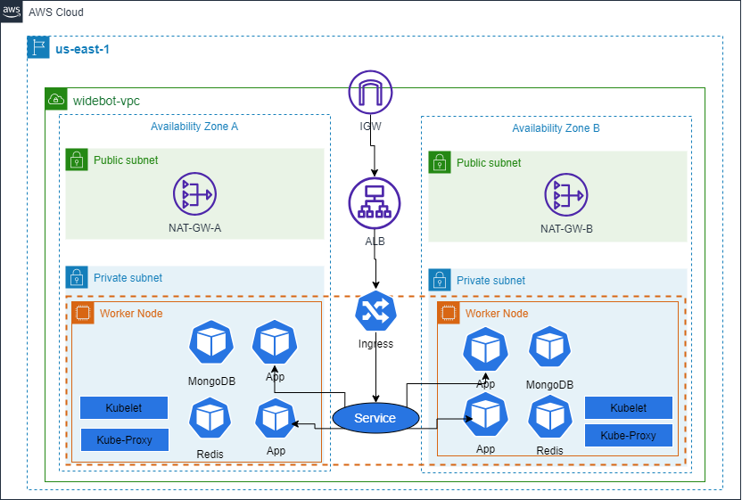

# WideBot EKS Task Second Solution
## Description
write a terraform template to provision the infrastructure for a web application and its associated databases (MongoDB), and Redis for caching.
configure Load Balancer to availability and auto scale to ensure scalability .
Use AWS EKS to let up a replication controller to run pods that are accessed as services on Docker.

## Design

<!-- BEGIN_TF_DOCS -->
## Requirements

| Name | Version |
|------|---------|
|  [aws](#requirement\_aws) | 4.67.0 |

## Providers

No providers.

## Modules

| Name | Source | Version |
|------|--------|---------|
|  [EKS](#module\_EKS) | ./modules/EKS | n/a |
|  [IAM](#module\_IAM) | ./modules/IAM | n/a |
|  [NAT-GW](#module\_NAT-GW) | ./modules/nat-gw | n/a |
|  [NODE\_GROUP](#module\_NODE\_GROUP) | ./modules/Node-group | n/a |
|  [VPC](#module\_VPC) | ./modules/vpc | n/a |

## Resources

| Name | Type |
|------|------|
|[alimostafa95/widebot:latest](https://hub.docker.com/repository/docker/alimostafa95/widebot/tags?page=1&ordering=last_updated) | image |

## Inputs

| Name | Description | Type | Default | Required |
|------|-------------|------|---------|:--------:|
|  [PRI\_SUB\_3\_A\_CIDR](#input\_PRI\_SUB\_3\_A\_CIDR) | n/a | `any` | n/a | yes |
|  [PRI\_SUB\_4\_B\_CIDR](#input\_PRI\_SUB\_4\_B\_CIDR) | n/a | `any` | n/a | yes |
|  [PROJECT\_NAME](#input\_PROJECT\_NAME) | n/a | `string` | n/a | yes |
|  [PUB\_SUB\_1\_A\_CIDR](#input\_PUB\_SUB\_1\_A\_CIDR) | n/a | `any` | n/a | yes |
|  [PUB\_SUB\_2\_B\_CIDR](#input\_PUB\_SUB\_2\_B\_CIDR) | n/a | `any` | n/a | yes |
|  [REGION](#input\_REGION) | n/a | `string` | n/a | yes |
|  [VPC\_CIDR](#input\_VPC\_CIDR) | n/a | `any` | n/a | yes |

## Outputs

No outputs.
<!-- END_TF_DOCS -->